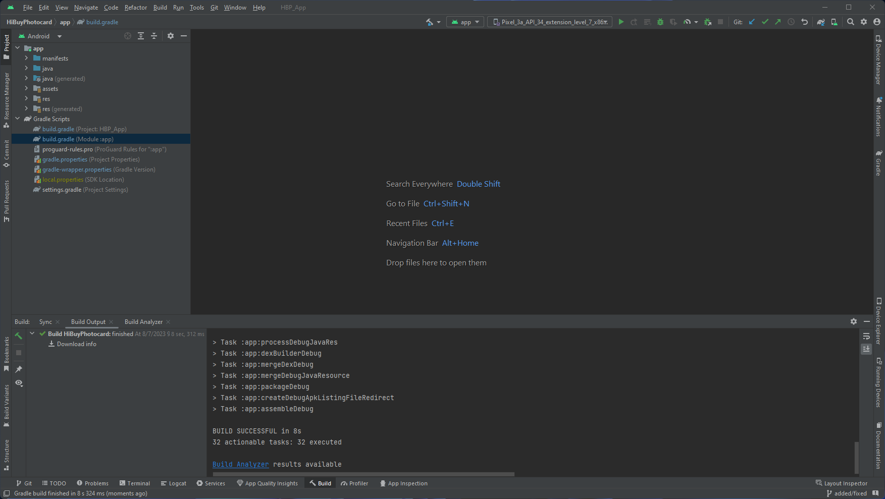

# HiBuyPhotocard

> 자동 라벨링 기능을 탑재한 포토카드 거래 플랫폼

## 프로젝트 소개 및 개요

해당 프로젝트는 2021 졸업프로젝트입니다. 포토카드 거래 시 발생하는 어려움을 해결하기 위해 만든 모바일 어플리케이션입니다. 해당 프로젝트는 [어플리케이션 시연 영상](https://youtu.be/ZEZjHX_0w64)을 확인하시면 됩니다. 해당 프로젝트의 주요 특징은 아래와 같습니다.

* 판매글 등록 시 이미지 분류 AI 모델을 통해 자동 분류 및 라벨링하여 편리함 제공
* 태그 기반 검색으로 포토카드 검색 소요시간 감소

## 개발 환경

### Android

- Android Studio >= 2022.3.1
- Java >= 1.8

### Machine Learning Model

- Colab
- Tensorflow

## 주의사항

* 컴파일은 가능하지만, `Firebase` 설정 등이 진행 되어야 하기 때문에, 사용시 주의를 요구합니다.

## Ref

* [.gitignore](https://www.toptal.com/developers/gitignore)